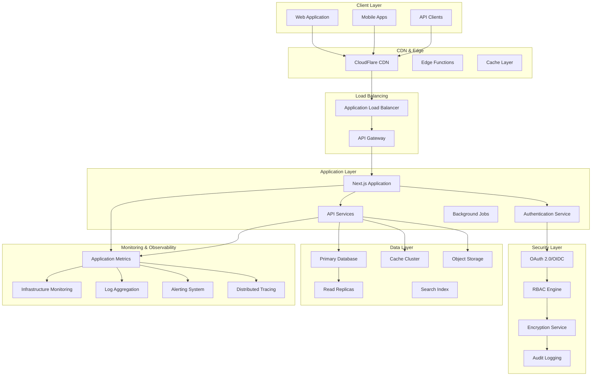

# Enterprise SaaS Platform Architecture

## Executive Summary

This document outlines the comprehensive architecture for an enterprise-grade, multi-tenant SaaS platform designed to meet production standards for security, reliability, performance, and maintainability. The platform implements modern cloud-native patterns with multi-tenancy, advanced security, and enterprise compliance features.

## Architecture Overview

### High-Level System Architecture

## Core Architecture Principles

### 1. Multi-Tenancy Architecture

**Tenant Isolation Strategy**: Row-Level Security (RLS) with tenant-specific schemas

- **Data Isolation**: Each tenant's data is logically separated using tenant_id
- **Resource Isolation**: Tenant-specific quotas and rate limits
- **Security Isolation**: Per-tenant encryption keys and access controls

**Multi-Tenancy Models**:

- **Soft Multi-tenancy**: Shared infrastructure with data isolation (current implementation)
- **Hybrid Multi-tenancy**: Premium tenants get dedicated resources
- **Full Multi-tenancy**: Enterprise tenants get isolated infrastructure

### 2. Security Architecture

**Authentication & Authorization**:

- OAuth 2.0/OIDC with multiple identity providers
- Role-Based Access Control (RBAC) with fine-grained permissions
- Multi-factor authentication (MFA) support
- Session management with JWT tokens

**Data Security**:

- Encryption at rest using AES-256
- Encryption in transit using TLS 1.3
- Field-level encryption for PII data
- Key rotation and management

**Compliance Framework**:

- GDPR compliance with data portability and right to be forgotten
- CCPA compliance for California users
- SOC 2 Type II compliance preparation
- HIPAA compliance for healthcare customers

### 3. Scalability & Performance

**Horizontal Scaling**:

- Stateless application design
- Auto-scaling based on metrics
- Database read replicas
- CDN for static assets

**Performance Optimization**:

- Multi-layer caching strategy
- Database query optimization
- Image optimization and compression
- Code splitting and lazy loading

**Load Distribution**:

- Geographic load balancing
- Database sharding strategies
- Microservices architecture
- Event-driven architecture

### 4. Reliability & Availability

**High Availability**:

- Multi-region deployment
- Database clustering with failover
- Service mesh for resilience
- Circuit breaker patterns

**Disaster Recovery**:

- Automated backups with point-in-time recovery
- Cross-region replication
- Disaster recovery runbooks
- Business continuity planning

**Monitoring & Observability**:

- Comprehensive logging with structured logs
- Real-time metrics and dashboards
- Distributed tracing for microservices
- Proactive alerting and incident response

## Technology Stack

### Frontend

- **Framework**: Next.js 14+ with App Router
- **Styling**: Tailwind CSS with design system
- **State Management**: Zustand for client state
- **UI Components**: Radix UI primitives
- **Real-time**: WebSockets for live updates

### Backend

- **Runtime**: Node.js 18+ with TypeScript
- **API Layer**: Next.js API Routes with route handlers
- **Authentication**: Supabase Auth with custom RBAC
- **Database**: PostgreSQL with multi-tenancy
- **Cache**: Redis for session and application cache

### Infrastructure

- **Hosting**: Vercel for frontend, Railway/Render for backend
- **Database**: Supabase PostgreSQL with read replicas
- **CDN**: CloudFlare for global content delivery
- **Monitoring**: Sentry for error tracking, DataDog for metrics
- **CI/CD**: GitHub Actions with automated testing

### Security & Compliance

- **Encryption**: AWS KMS for key management
- **Secrets**: Environment variables with rotation
- **Audit**: Comprehensive audit logging
- **Compliance**: Automated compliance checks

## Implementation Phases

### Phase 1: Core Infrastructure (Current Focus)

1. Multi-tenant database schema
2. Enhanced authentication system
3. API management layer
4. Basic monitoring setup

### Phase 2: Security & Compliance

1. Advanced security features
2. Compliance framework
3. Audit logging system
4. Data encryption implementation

### Phase 3: Scalability & Performance

1. Caching layers
2. Database optimization
3. CDN integration
4. Performance monitoring

### Phase 4: Enterprise Features

1. SLA definitions
2. Incident response system
3. Advanced monitoring
4. Disaster recovery

## Security Considerations

### Authentication Security

- Multi-factor authentication (MFA)
- Session timeout and refresh
- Suspicious activity detection
- Brute force protection

### Data Protection

- Encryption at rest and in transit
- Data masking for non-production environments
- Regular security audits
- Vulnerability scanning

### Access Control

- Principle of least privilege
- Regular access reviews
- Segregation of duties
- Audit trail maintenance

## Performance Requirements

### Response Time Targets

- API responses: < 200ms (95th percentile)
- Page loads: < 2 seconds (first contentful paint)
- Database queries: < 100ms (average)

### Scalability Targets

- Support 10,000+ concurrent users
- Handle 1M+ API requests per day
- 99.9% uptime SLA
- Auto-scale based on demand

### Resource Optimization

- Efficient database queries
- Optimized bundle sizes
- Lazy loading implementation
- Resource caching strategies

## Compliance & Governance

### Data Governance

- Data classification framework
- Retention policy implementation
- Data lineage tracking
- Privacy by design principles

### Regulatory Compliance

- GDPR Article 32 security measures
- CCPA consumer rights implementation
- SOC 2 Type II controls
- Industry-specific regulations

## Risk Management

### Security Risks

- Data breach mitigation
- Insider threat detection
- Supply chain security
- Incident response planning

### Operational Risks

- Service dependency mapping
- Capacity planning
- Performance monitoring
- Disaster recovery testing

This architecture provides a solid foundation for building a scalable, secure, and compliant enterprise SaaS platform that can grow with business needs while maintaining high standards for security and reliability.
